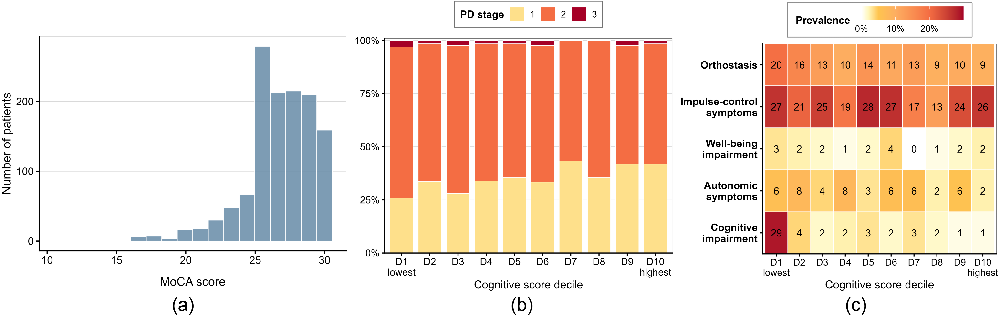
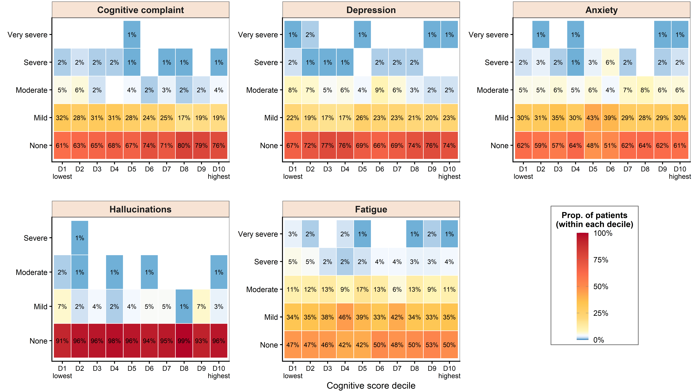
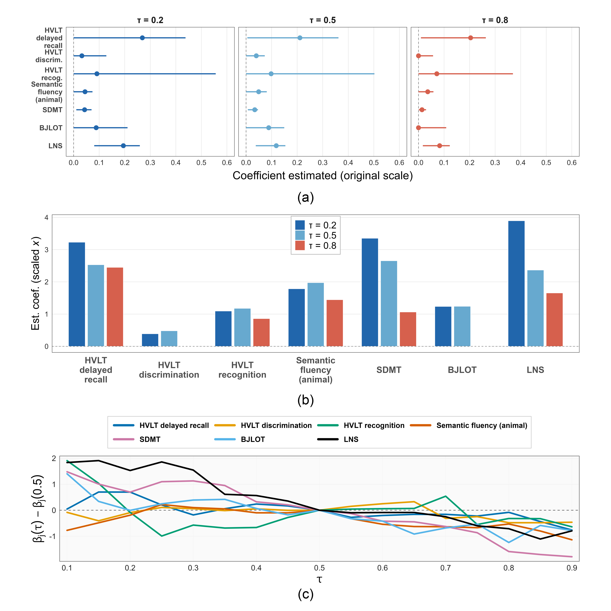

# UNIQUE: Univariate-Guided Sparse Noncrossing Quantile Regression for Cognitive Heterogeneity in Parkinson’s Disease

A sparse simultaneous quantile regression framework for studying **distributional heterogeneity**, **lower-tail vulnerability**, and **clinically interpretable predictor effects** in Parkinson’s disease cognition.


## 📚 Citation
 
> XXX et al. (2026).  
> *UNIQUE: Univariate-Guided Sparse Noncrossing Quantile Regression for Cognitive Heterogeneity in Parkinson’s Disease*.  
> ArXiv: coming soon.

---

## 📌 Overview

Cognitive decline in Parkinson’s disease is highly heterogeneous. For outcomes such as the Montreal Cognitive Assessment (MoCA), the most clinically relevant signal often lies in the **lower tail** of the cognitive score distribution, where patients are most vulnerable to progression toward cognitive impairment and dementia.

Standard mean regression targets average effects, while separately fitted quantile regressions can produce:

- crossing estimated quantile curves  
- unstable coefficient paths across quantiles  
- dense models with weak interpretability  
- clinically implausible sign reversals under correlated neurocognitive predictors  

**UNIQUE** addresses these issues by jointly enforcing:

- global noncrossing of estimated conditional quantile functions  
- structured sparsity across quantiles  
- selective sign consistency for clinically established predictors  
- flexible estimation for weaker or context-dependent variables  

---

## 🧠 Core Idea

UNIQUE uses univariate quantile regressions as interpretable building blocks and then aggregates them through a sparse constrained stacking model.

For each predictor $j$ and quantile level $\tau_k$, we first fit a marginal quantile regression:

$$
(\hat\beta_{0j,k}, \hat\beta_{j,k})
= \arg\min_{b_0,b}
\sum_{i=1}^{n}
\rho_{\tau_k}(y_i - b_0 - b x_{ij})
$$

where

$$\rho_{\tau}(u)=u(\tau - \mathbf{1}(u < 0))$$

The marginal fitted learner is

$$\hat\eta_{ij,k}=\hat\beta_{0j,k}+\hat\beta_{j,k} x_{ij}$$

UNIQUE then learns sparse nonnegative aggregation weights $\theta_{jk}$ so that the final quantile estimator is

$$\widehat Q(\tau_k \mid x)=\hat\theta_{0k}+\sum_{j=1}^{p}\hat\theta_{jk}(\hat\beta_{0j,k}+\hat\beta_{j,k} x_j)$$

The nonnegative aggregation weights preserve the sign of marginal quantile effects for selected predictors, while the model can shrink weak predictors exactly to zero.

---

## ⚙️ UNIQUE Optimization Problem

UNIQUE estimates stacking weights by minimizing the quantile loss plus a structured sparsity penalty:

$$\min_{\theta_0,\theta}\frac{1}{n}\sum_{k=1}^{K}\sum_{i=1}^{n}\rho_{\tau_k}\Big[y_i-\tilde q_{ik}(\theta_0,\theta)\Big]+\lambda_n\sum_{j=1}^{p}\left(\sum_{k=1}^{K}\omega_{jk}\theta_{jk}\right)^{1/2}$$

where

$$\tilde q_{ik}(\theta_0,\theta)=\theta_{0k}+\sum_{j=1}^{p}\hat\eta_{ij,k}^{CF}\theta_{jk}$$

The penalty

$$\sum_{j=1}^{p}\left(\sum_{k=1}^{K}\omega_{jk}\theta_{jk}\right)^{1/2}$$

encourages predictor-level sparsity while allowing quantile-specific heterogeneity.

---

## 🔒 Global Noncrossing Constraint

The estimated quantile functions are required to satisfy

$$\widehat Q(\tau_1 \mid x)\le\widehat Q(\tau_2 \mid x)\le\cdots\le\widehat Q(\tau_K \mid x)$$

for all covariate values $x$.

Because the fitted quantile functions are affine in $x$, global noncrossing over the scaled predictor domain can be written as a finite system of linear inequalities:

$$A\Gamma \ge 0$$

where

$$\Gamma=(\theta_0^{\top},\theta^{\top},s^{\top})^{\top}$$

contains intercept weights, aggregation weights, and slack variables.

---

## 🎯 Selective Sign Constraints

A key feature of UNIQUE is that sign constraints are imposed **selectively**, not universally.

For predictors with strong prior clinical evidence, UNIQUE restricts coefficient directions to agree with the corresponding marginal quantile relationships. For weaker or context-dependent predictors, the conditional effects are left unconstrained.

This differs from broad univariate-guided sign alignment (e.g., UniLasso), where all conditional signs are forced to agree with marginal signs. UNIQUE uses marginal quantile effects as interpretable anchors only when the scientific direction is well established.

---

## ⚖️ Signal-Adaptive Penalty Weights

UNIQUE uses adaptive weights $\omega_{jk}$ to reflect predictor strength and quantile-specific signal:

$$signal_{jk}=q_j\cdot\frac{|\hat\beta_{j,k}^{mult}|}{median_{j,k}|\hat\beta_{j,k}^{mult}|}$$

and

$$\omega_{jk}=\frac{1}{signal_{jk}+\varepsilon_w}$$

Here:

- $q_j$ measures the univariate quantile fit quality of predictor $j$  
- $\hat\beta_{j,k}^{mult}$ is a multivariable quantile regression estimate  
- $\varepsilon_w$ is a small stabilization constant  

Large weights induce stronger shrinkage, while small weights protect stronger signals.

---
## 🔍 Scientific Motivation: Cognitive Heterogeneity in Parkinson’s Disease

The case study focuses on MoCA cognitive score heterogeneity in Parkinson’s disease using the Parkinson’s Progression Markers Initiative (PPMI).

<p align="center">
  
</p>

This figure summarizes:

- the empirical MoCA distribution  
- Parkinson’s disease stage composition across MoCA deciles  
- prevalence of major symptom domains across MoCA deciles  

The lower tail of the MoCA distribution contains clinically vulnerable individuals with greater cognitive impairment and symptom burden, motivating quantile-specific rather than mean-only analysis.

---

## 🧩 Ordinal Symptom Profiles Across Cognitive Deciles

<p align="center">
  
</p>

This figure shows ordinal symptom severity profiles across MoCA deciles for selected non-motor symptoms, including cognitive complaint, depression, anxiety, hallucinations, and fatigue.

The goal is to motivate distributional modeling of cognition: lower cognitive deciles are not simply noisy deviations around the mean, but correspond to clinically meaningful differences in symptom burden.

---

## 🧮 SAPS Optimization

The UNIQUE objective is non-smooth, non-convex, and constrained by global noncrossing inequalities. We solve it using **SAPS**:

> Stochastic Annealed Pattern Search

SAPS combines:

- adaptive coordinate-wise pattern search for efficient local improvement  
- occasional global exploration using hit-and-run proposals  
- simulated annealing acceptance to escape local minima  
- feasibility checks under the linear noncrossing constraint system  

At each iteration, SAPS performs either a local move or a global move.

### Local move

A coordinate direction is selected adaptively:

$$\mathcal{D}=\{\pm e_1,\ldots,\pm e_N\}.$$

A candidate is proposed as

$$\boldsymbol{x}^{\star}=\boldsymbol{x}^{(t-1)}+\delta_t a_{j_t}^{(t-1)} e_{i_t}.$$

The move is accepted if it preserves feasibility and improves the objective.

### Global move

With fixed positive probability, SAPS performs hit-and-run exploration in the lifted feasible polyhedron. A simulated annealing rule accepts worse proposals with probability

$$\exp\left(-\frac{f(\boldsymbol{x}^{\dagger})-f(\boldsymbol{x}^{(t-1)})}{T_r}\right),$$

with logarithmic cooling

$$T_r=\frac{c_{\log}}{\log(2+r)}.$$

---

## 📐 Theoretical Guarantee

Let

$$\mathcal{X}=\left[\boldsymbol{x}\in[\boldsymbol{\ell},\boldsymbol{u}]:A\boldsymbol{\Gamma}(\boldsymbol{x})\ge 0 \right]$$

be the feasible set, and let

$$\mathcal{X}^{\star}=\arg\min_{\boldsymbol{x}\in\mathcal{X}} f(\boldsymbol{x})$$

be the set of global minimizers.

Under compactness, continuity, irreducibility of the hit-and-run proposal kernel, logarithmic cooling, and feasibility preservation, the global-move subsequence of SAPS converges in probability to $\mathcal{X}^{\star}$, and the retained best-so-far objective converges almost surely to the global optimum.

---

## 🧪 Simulation Study

The simulation study evaluates UNIQUE under sparse quantile-varying linear models with exact noncrossing structure.

Data are generated using a latent-uniform model:

$$Y_i=\beta_0(U_i)+\sum_{j=1}^{p_0}X_{ij}\beta_j(U_i),\quad U_i \sim \mathrm{Unif}(0,1).$$

This induces the conditional quantile function

$$Q_Y(\tau\mid X_i)=\beta_0(\tau)+\sum_{j=1}^{p_0}X_{ij}\beta_j(\tau).$$

The simulations compare:

- UNIQUE  
- Lasso-QR  
- NC-QR  

across independent and correlated designs.

The main performance metrics include:

- true positive rate  
- false positive rate  
- false discovery rate  
- Matthews correlation coefficient  
- RMSE of coefficient functions  
- RMSE of quantile functions  
- sign agreement and sign opposition  
- computation time  

---

## 🧬 PPMI Case Study

The real data analysis studies cognitive heterogeneity among Parkinson’s disease patients in PPMI.

Outcome:

- Montreal Cognitive Assessment score  
- higher values indicate better cognition  
- lower values indicate greater impairment  

Predictor domains include:

- verbal memory  
- executive function  
- processing speed  
- visuospatial ability  
- mood  
- olfaction  
- gait dysfunction  
- sleep disturbance  
- autonomic burden  
- motor severity  
- demographics  
- genetic susceptibility  

The final analysis identifies interpretable neurocognitive drivers of lower-tail vulnerability while preserving global noncrossing and stable sign behavior.

## 📈 Quantile-Specific Coefficient Profiles

<p align="center">
  
</p>

UNIQUE estimates coefficient trajectories across the quantile grid.

The selected neurocognitive predictors include:

- HVLT delayed recall  
- HVLT discrimination  
- HVLT recognition  
- semantic fluency  
- SDMT  
- BJLOT  
- LNS  

These profiles show how predictor effects vary across the MoCA distribution.

---

## 📊 Estimated Effects and Heterogeneity

<p align="center">
  
</p>

This figure summarizes the main case study findings:

- original-scale coefficient estimates with bootstrap confidence intervals  
- standardized coefficient magnitudes for comparing relative importance  
- centered coefficient trajectories showing quantile-specific heterogeneity  

UNIQUE identifies delayed verbal recall, processing speed, working memory, and executive function as major drivers of lower-tail cognitive vulnerability.

---

## 📉 Conditional Quantile Curves

<p align="center">
  
</p>

This figure displays fitted conditional quantile curves at selected quantile levels.

All remaining covariates are fixed at median values, and the plotted curves illustrate how cognitive score changes with selected neurocognitive predictors while preserving the noncrossing structure.

---

## 📁 Repository Structure

| Folder | Description |
|--------|-------------|
| `Motivating study/` | Scripts for introductory sign-comparison table |
| `Simulation study/` | Scripts for simulation data generation, fitting, and summaries |
| `Case study/` | PPMI case study analysis, bootstrap, out-of-sample comparison, and plots |
| `DEMO/` | Minimal demonstration of UNIQUE on an example dataset |
| `images/` | Figures displayed in this README and manuscript |
| `UNIQUE_Reproducibility_Instructions.pdf` | Full reproducibility instructions |

---

## 🧮 Figures and Tables in the Paper

The table below maps manuscript outputs to scripts used to generate them.

| Output | Description | Script Path |
|--------|-------------|-------------|
| **Figure 1** | MoCA distribution, PD stage, and symptom-domain prevalence across MoCA deciles | `Case study/Plot_UNIQUE_motivation.R` |
| **Figure 2** | Ordinal non-motor symptom severity profiles across MoCA deciles | `Case study/Plot_UNIQUE_motivation.R` |
| **Figure 3** | Quantile-specific coefficient profiles for selected neurocognitive predictors | `Case study/Plot_case_study_1.R` |
| **Figure 4** | Estimated conditional quantile curves on original predictor scales | `Case study/Plot_case_study_2.R` |
| **Figure 5** | Original-scale effects, standardized effect magnitudes, and coefficient heterogeneity | `Case study/Plot_case_study_1.R` |
| **Table 1** | Sign comparison across univariate QR, Lasso-QR, NC-QR, and UNIQUE | `Motivating study/Intro_table_uniQR_vs_lassoQR.R` and `Motivating study/Intro_table_NCQR_UNIQUE.m` |
| **Table 2** | Simulation study performance summary | `Simulation study/SUMMARY_all_reps.m` |
| **Table 3** | Sign-constraint specification | Descriptive table |
| **Table 4** | Out-of-sample performance comparison | `Case study/Case_study_OOS_performance.m` |
| **Table S1** | Variable definitions for PPMI case study | Descriptive table |

---

## 🔁 Reproducibility Instructions

Detailed reproduction steps are provided in:

```text
UNIQUE_Reproducibility_Instructions.pdf
```
---
## 🔐 Data Access

The PPMI dataset used in this study was accessed through the official repository:  [https://www.ppmi-info.org/](https://www.ppmi-info.org/). Due to data privacy and usage restrictions, the dataset is not redistributed in this repository. Users should obtain access directly from the PPMI portal.
---

## 💬 Contact

For questions, please contact:  
**Priyam Das**  
[dasp4@vcu.edu](mailto:dasp4@vcu.edu)
